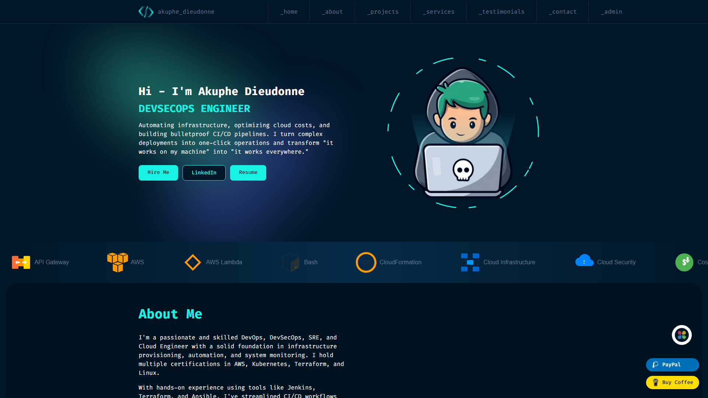
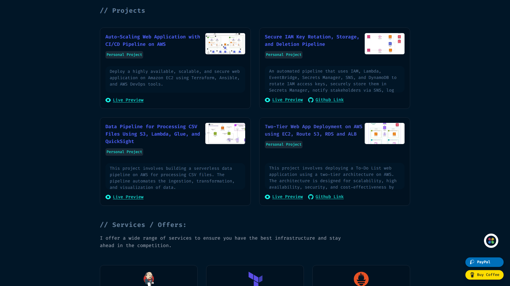
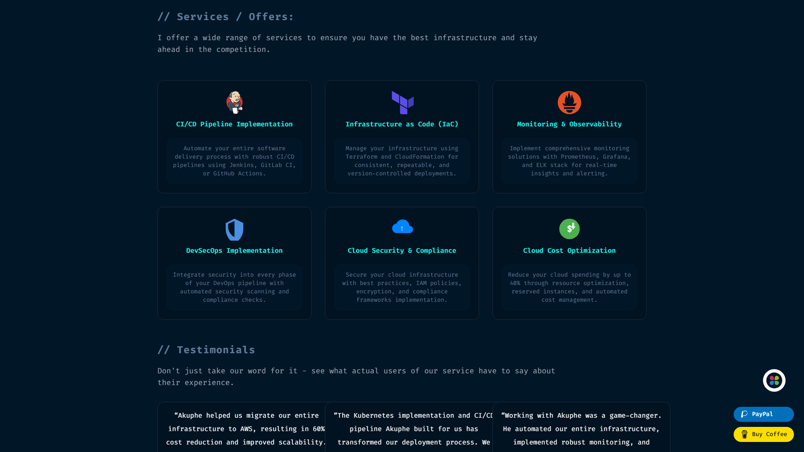
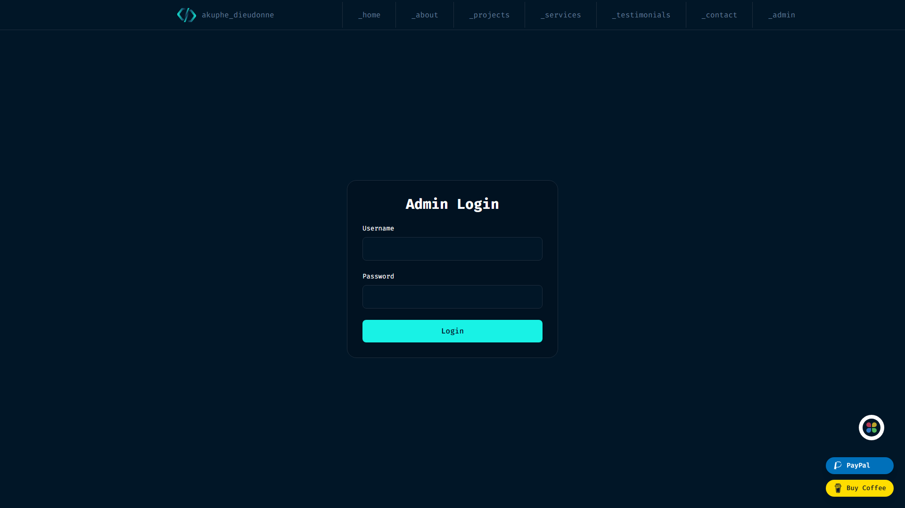
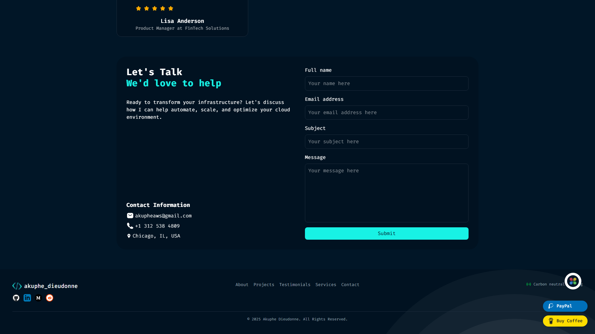

# Akuphe Cloud - DevOps Portfolio with Dynamic CMS


A **dynamic portfolio website** with full CMS capabilities, built for DevOps professionals. Features real-time content management, admin dashboard, and seamless deployment on Vercel.

🌐 **Live Demo**: [https://akuphecloud.com](https://akuphecloud.com)



## 🚀 Features

### For Visitors
- 💼 **Dynamic Project Showcase** - Projects with live previews, GitHub links, and metrics
- 🛠️ **Services Section** - DevOps services with custom icons
- 💬 **Testimonials** - Client feedback with ratings
- 📬 **Contact Form** - Direct email integration
- 📱 **Fully Responsive** - Works on all devices
- 🌓 **Dark/Light Theme** - User preference support

### For Administrators
- 🔐 **Secure Admin Dashboard** - Password-protected content management
- ✏️ **Real-time CRUD Operations** - Add, edit, delete content instantly
- 📊 **Message Management** - View and manage contact form submissions
- 🚀 **No Code Updates** - Change content without touching code
- ⚡ **Instant Updates** - Changes reflect immediately on the live site

## 📷 Screenshots

### Projects Section


### Services Section


### Admin Dashboard


### Contact Section


## 📋 Prerequisites

- Node.js 18.17 or higher
- npm or yarn
- MongoDB Atlas account (free tier works)
- Vercel account for deployment

## 🛠️ Quick Start

### 1. Clone the Repository
```bash
git clone https://github.com/akupheaws/akuphecloud-portfolio.git
cd akuphecloud-portfolio
```

### 2. Install Dependencies
```bash
npm install
# or
yarn install
```

### 3. Configure Environment Variables
Create a `.env.local` file in the root directory:

```env
# MongoDB Configuration
MONGODB_URI=your_mongodb_connection_string

# Email Configuration (for contact form)
SMTP_HOST=smtp.gmail.com
SMTP_PORT=587
SMTP_USER=your-email@gmail.com
SMTP_PASSWORD=your-app-password
EMAIL_FROM=noreply@akuphecloud.com
EMAIL_TO=admin@akuphecloud.com

# Site Configuration
NEXT_PUBLIC_SITE_URL=http://localhost:3000
```

### 4. Set Up MongoDB
1. Create a free cluster at [MongoDB Atlas](https://www.mongodb.com/cloud/atlas)
2. Add your connection string to `.env.local`
3. Seed initial data:
```bash
node seed-all.mjs
```

### 5. Run Development Server
```bash
npm run dev
```

Visit `http://localhost:3000` to see your portfolio.

## 📁 Project Structure

```
akuphecloud-portfolio/
├── src/
│   ├── app/                    # Next.js App Router pages
│   ├── components/            # React components
│   ├── actions/              # Server actions for database
│   ├── lib/                  # Database connection & utilities
│   └── utils/                # Helper functions
├── public/                   # Static assets & resume
├── content/                  # JSON seed data
├── scripts/                  # Utility scripts
└── PROJECT_DOCUMENTATION.md  # Full technical documentation
```

## 🎨 Customization Guide

### 1. Personal Information
Edit `src/appData/personal.tsx`:
- Update name, bio, social links
- Modify hero section content

### 2. Skills & Services
Edit `src/appData/index.ts`:
- Add/remove skills with icons
- Update service offerings

### 3. Admin Credentials
The default admin login is configured in your environment. Update as needed.

### 4. Theme & Styling
- Colors: Edit `src/app/globals.css`
- Layout: Modify components in `src/components/`

## 🚀 Deployment

### Deploy to Vercel (Recommended)

1. **Via Vercel CLI**:
```bash
npm i -g vercel
vercel --prod
```

2. **Via GitHub Integration**:
- Push to GitHub
- Import project in Vercel Dashboard
- Add environment variables
- Deploy automatically

### Environment Variables in Vercel
Add all variables from `.env.local` in:
- Vercel Dashboard → Settings → Environment Variables
- Apply to: Production, Preview, Development

## 📸 Generate Screenshots

Create professional screenshots for portfolio showcases:

```bash
# Install Playwright
npm install --save-dev playwright
npx playwright install

# Generate screenshots
node scripts/generate-screenshots.js
```

Screenshots will be saved in `/screenshots` folder.

## 🔧 Admin Panel Access

1. Navigate to `/admin`
2. Login with your credentials
3. Manage:
   - Projects
   - Services
   - Skills
   - Testimonials
   - Contact Messages

## 📚 Documentation

- **[PROJECT_DOCUMENTATION.md](./PROJECT_DOCUMENTATION.md)** - Complete technical documentation with architecture diagrams
- **[SETUP_GUIDE.md](./SETUP_GUIDE.md)** - Detailed setup and deployment instructions

## 🛡️ Security Features

- Environment variable protection
- Secure authentication for admin panel
- Input validation and sanitization
- MongoDB injection prevention
- XSS protection

## 🤝 Contributing

1. Fork the repository
2. Create your feature branch (`git checkout -b feature/AmazingFeature`)
3. Commit your changes (`git commit -m 'Add some AmazingFeature'`)
4. Push to the branch (`git push origin feature/AmazingFeature`)
5. Open a Pull Request

## 📝 License

This project is licensed under the MIT License - see the [LICENSE](LICENSE) file for details.

## 🙏 Acknowledgments

- Built with Next.js and MongoDB
- Enhanced with dynamic CMS capabilities
- Deployed and maintained on Vercel

## 📞 Support

For issues, questions, or suggestions:
- Create an issue in this repository
- Contact via the portfolio contact form

---

Built with ❤️ using Next.js, MongoDB, and Vercel